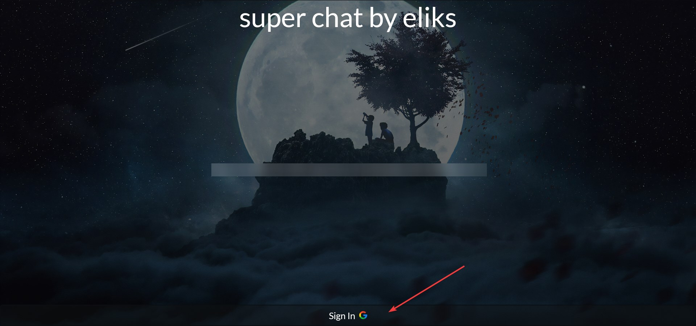
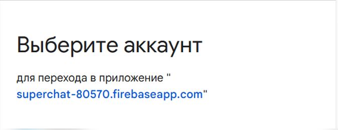
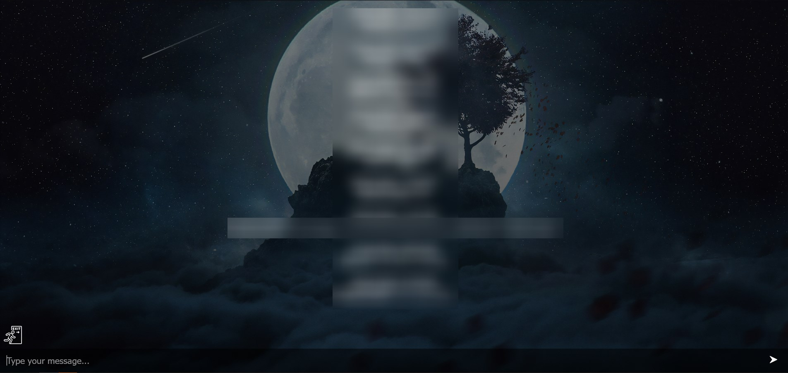
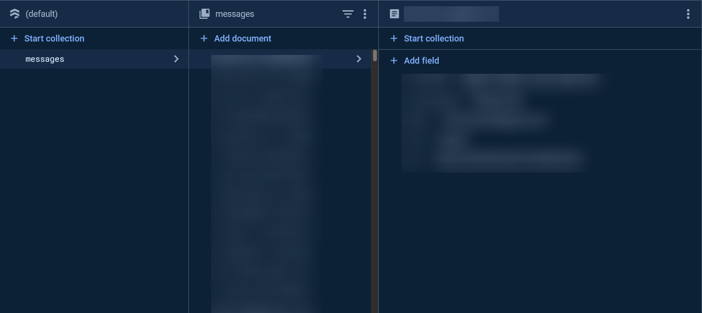

# Online Chat Made using React and Firebase

## How to Use?
Follow the [link](https://elikschat.netlify.app/) for the website and press the `Sign In` button



Select the account you want (Don't worry about account theft, the project uses Firebase from Google. You can check for yourself that all the windows popping out are real and official)



Enjoy!



## Prerequisites
- [Node.js](https://nodejs.org/) (v12.x or later)
- [npm](https://www.npmjs.com/get-npm) (comes with Node.js)

## Installation
1.  **Clone the repository:**
    ```bash
    https://github.com/yourusername/elikschat.git
    cd elikschat
    ```
2. **Install dependencies:**

   ```bash
   npm install
   ```
3. **Run the server:**
    ```bash
    npm start
    ```

## How it works?

All the messages store in Firebase DB `messages`. From React client the request is sent to this database and then return the values(e.g. Nickname, Message itself).

